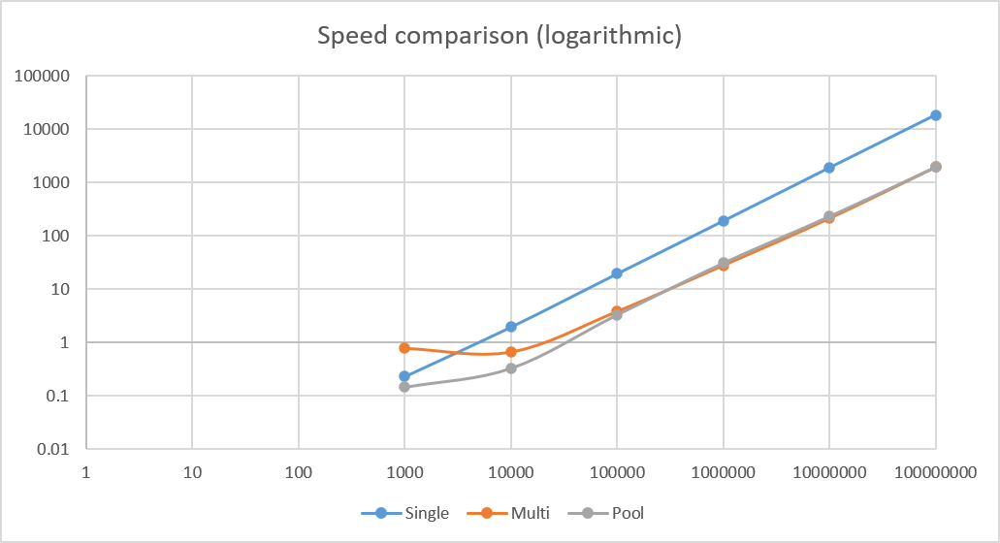
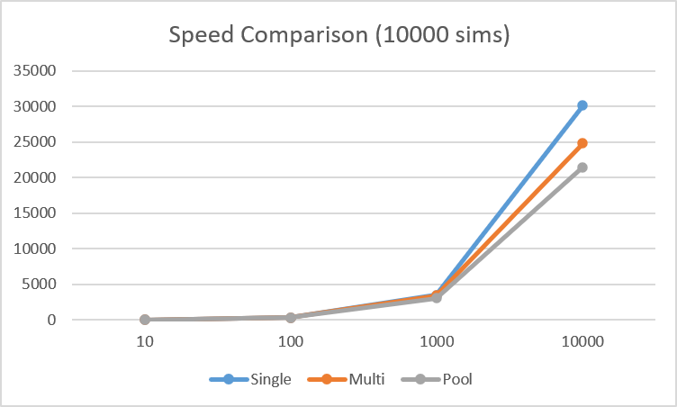

# Monte-Carlo-option-pricer

This programme calculates vanilla call and put option prices via a monte carlo method. The monte carlo method is run on the main thread, multiple threads (12), and
via a thread pool. The time each method took is measured and compared for different amounts of simulations, demonstrating the speed advantage of using multiple threads.
In addition to this, a comparison was made between the time it took each method to price multiple options for a set number of simulations, demonstrating the advantage
of using a threadpool. All values calculated were compared to values calculated via the Black-Scholes equation and found to be within two standard errors.

# Results

| Sims      | Single  | Multi  | Pool   |
|-----------|---------|--------|--------|
| 1000      | 0.2326  | 0.768  | 0.1452 |
| 10000     | 1.9624  | 0.6544 | 0.3288 |
| 100000    | 19.5574 | 3.798  | 3.3114 |
| 1000000   | 190.5   | 27.75  | 31     |
| 10000000  | 1894.8  | 212.4  | 231.8  |
| 100000000 | 18443.4 | 1946.8 | 1956.2 |

| Options | Single   | Multi    | Pool     |
|---------|----------|----------|----------|
| 10      | 35.33333 | 36.33333 | 32.33333 |
| 100     | 339.6667 | 360.3333 | 325      |
| 1000    | 3527.333 | 3467.667 | 3037.333 |
| 10000   | 30106.33 | 24838.33 | 21473.33 |

Time taken(ms) for different numbers of simulations:

All times are in milliseconds, first graph is logarithmic 

Compilation line (windows):
 g++ -Wall -o Monte-Carlo-option-pricer main.cpp Thread-Pool.cpp
.\Monte-Carlo-option-pricer.exe
